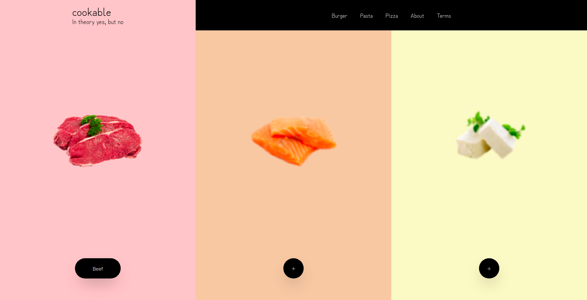

# Cookable

## Introduction
Hello there 👋! Want some inspiration on how an interactive form might look like
in the context of a delivery service? Then look no further! This angular project
is the perfect example for how minimalism and interactiveness can combine to create a
quick and flawless user experience.

## What it delivers
* A toolbar and a footer component
* Interactive form components for choosing food
* A component for displaying a choice of 3 items
* Pages for choosing a burger, a pizza or a pasta
* Simple integration for APIs with services

## A screenshot

The side with the beef is currently highlighted (you can't see the cursor in screenshots).

## What it's built with
* [Angular CLI](https://github.com/angular/angular-cli) version 12.2.11

Those are all the specific dependencies:

    "@angular/animations": "~12.2.0",
    "@angular/common": "~12.2.0",
    "@angular/compiler": "~12.2.0",
    "@angular/core": "~12.2.0",
    "@angular/forms": "~12.2.0",
    "@angular/platform-browser": "~12.2.0",
    "@angular/platform-browser-dynamic": "~12.2.0",
    "@angular/router": "~12.2.0",
    "@ngneat/tailwind": "^7.0.3",
    "rxjs": "~6.6.0",
    "tslib": "^2.3.0",
    "zone.js": "~0.11.4"

## Who did this?
Basically just me :) and if you want to contact me here's my email:
[pauljustus279@gmail.com](mailto:pauljustus279@gmail.com?subject=Cookable)

## Anything else
Note: The images are not mine and were picked from the internet at random.
